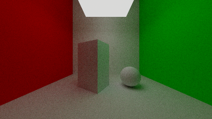
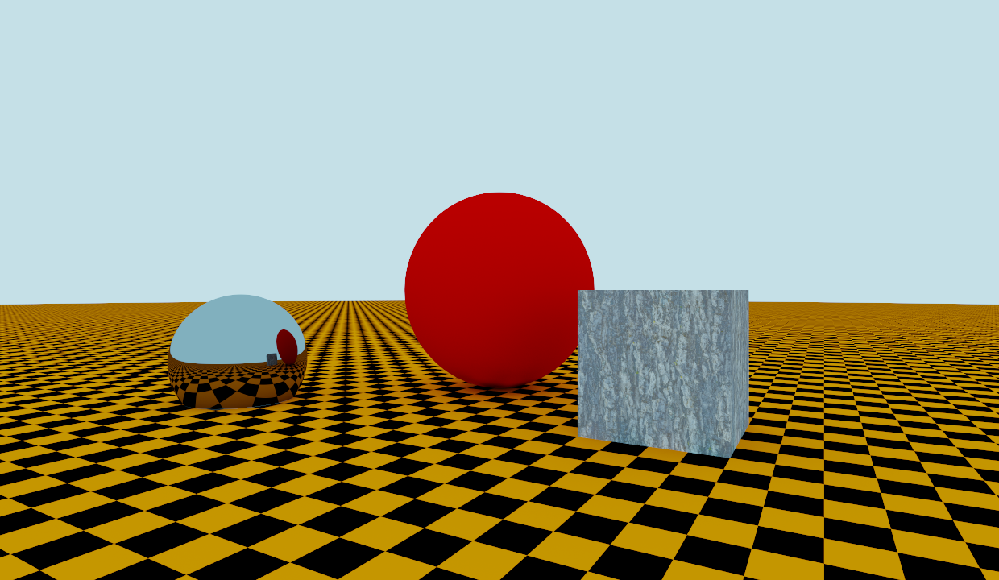
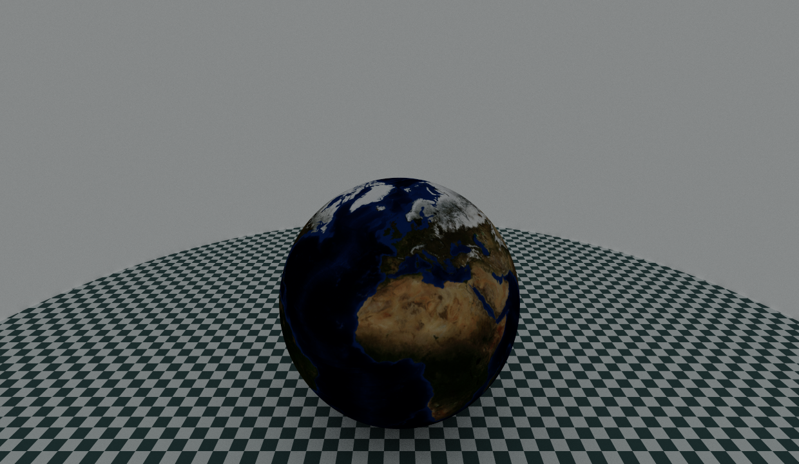

# SirRender

[](https://github.com/tommasoperitoree/SirRender/actions)
[](https://kotlinlang.org)
[](https://openjdk.org)
[](LICENSE)
[](https://tommasoperitoree.github.io/SirRender/)

A ray tracer written in Kotlin with Monte Carlo path tracing and direct point-light rendering.
SirRender renders 3D scenes defined in a lightweight text format and produces lossless
HDR output (`.pfm`) with optional tone-mapped PNG/JPEG export and animated GIF assembly.

Below are some examples of rendered images.

## Example renders

A small selection of scenes rendered with SirRender, showing path-traced lighting.

<table>
  <tr>
    <td width="33%" align="center">
      <br>
      <strong>Cornell box</strong><br>
      A simple interior scene with colored walls, diffuse objects, emissive lighting, and path-traced shadows.
    </td>
    <td width="33%" align="center">
      <br>
      <strong>Diffuse and mirror spheres with wooden cube</strong><br>
      A scene featuring a red diffuse sphere, a mirror sphere and a wooden cube on a checkered floor, lit by a fully emissive sky sphere.
    </td>
    <td width="33%" align="center">
      <br>
      <strong>World sphere on checkered ground</strong><br>
      A sphere mapped with an Earth texture, resting on a checkered floor under soft ambient lighting.
    </td>
  </tr>
</table>

---

## Contents

- [Example renders](#example-renders)
- [Features](#features)
- [Requirements](#requirements)
- [Building](#building)
- [Quick Start](#quick-start)
- [Commands](#commands)
    - [render](#render--render-a-scene-file)
    - [demo](#demo--render-the-built-in-demo)
    - [pfm-to-gif](#pfm-to-gif--assemble-pfm-frames-into-a-gif)
    - [pfm2png](#pfm2png--convert-pfm-to-ldr)
- [Animation Scripts](#animation-scripts)
    - [animateDemo.sh](#animatedemosh)
    - [animateScenes.sh](#animatescenessh)
- [Scene File Format](#scene-file-format)
- [Typical Workflows](#typical-workflows)
- [Architecture](#architecture)
- [API Documentation](#api-documentation)

---

## Features

- **Path tracing** with recursive Monte Carlo integration and Russian roulette termination
- **Point-light rendering** with direct illumination, hard shadows, BRDF evaluation and inverse-square distance attenuation
- **Four transformable shapes**: sphere, infinite plane, axis-aligned cube and cylinder — each fully transformable
- **Constructive Solid Geometry (CSG)**: build complex shapes by combining primitives with union, difference and intersection
- **Two BRDFs**: ideal Lambertian diffuse and perfect specular reflection
- **Three pigment types**: uniform color, procedural checkerboard, HDR image texture with bilinear interpolation
- **Two cameras**: orthogonal and perspective
- **Scene file compiler**: declare geometry, materials and camera in a readable `.txt` file
- **Antialiasing**: jittered supersampling with `a²` rays per pixel
- **HDR pipeline**: PFM storage → Reinhard tone mapping → gamma-corrected PNG/JPEG/WebP
- **Parallel rendering**: row-stripe partitioning across all CPU cores, fully deterministic
- **GIF animation**: `pfm-to-gif` assembles a folder of PFM frames into an animated GIF
- **Animation scripts**: `animateDemo.sh` and `animateScenes.sh` render full 360° MP4 animations

---

## Requirements

| Tool   | Version                    |
|--------|----------------------------|
| JDK    | 25 or higher               |
| Kotlin | 2.3.0 (bundled via Gradle) |

No other runtime dependencies. The only external library is
[Clikt](https://github.com/ajalt/clikt) for Command-Line (CLI) parsing.

---

## Building

Clone the repository and build the project with Gradle:

```bash
git clone https://github.com/tommasoperitoree/SirRender.git
cd SirRender
./gradlew build
```

For repeated use, install a standalone distribution. This avoids Gradle startup
overhead on every invocation:

```bash
./gradlew installDist
# Executable: build/install/SirRender/bin/SirRender
```

The rest of this guide uses `SirRender` as a shorthand for the installed executable.
Either add `build/install/SirRender/bin` to your `PATH`, or replace `SirRender` with the full executable path.

---

## Quick Start

Render a scene file and save both the HDR `.pfm` output and a tone-mapped PNG:

```bash
SirRender render --input-file scenes/RedSphere-CheckGround.txt --render
# → outputs/scenes/RedSphere-CheckGround.pfm
# → outputs/scenes/RedSphere-CheckGround.png
```

Render the built-in demo from a specific observer angle:

```bash
SirRender demo --observer-angle 45 --render
```

Convert an existing PFM to PNG with custom tone-mapping settings:

```bash
SirRender pfm2png scene.pfm output.png --factor 0.3 --gamma 2.2
```

---

## Commands

SirRender provides four main CLI commands:

| Command      | Purpose                                                            |
|--------------|--------------------------------------------------------------------|
| `render`     | Render a `.txt` scene file to HDR `.pfm`, with optional PNG export |
| `demo`       | Render the built-in demo scene                                     |
| `pfm2png`    | Convert an existing `.pfm` file to a standard image format         |
| `pfm-to-gif` | Assemble a folder of `.pfm` frames into an animated GIF            |

Use `--help` after any command to see the full list of available options:

```bash
SirRender render --help
SirRender demo --help
SirRender pfm2png --help
SirRender pfm-to-gif --help
```

### `render` — Render a Scene File

Loads a `.txt` scene description, renders it using either the path tracer or the
point-light renderer, and writes the result as a `.pfm` file. Pass `--render`
to also produce a tone-mapped PNG.

```bash
SirRender render [options]
```

| Option              | Short   | Default                | Description                                                 |
|---------------------|---------|------------------------|-------------------------------------------------------------|
| `--input-file`      | `-inp`  | `SceneR/sceneFile.txt` | Path to the scene file                                      |
| `--width`           | `-w`    | `640`                  | Image width in pixels                                       |
| `--height`          | `-h`    | `360`                  | Image height in pixels                                      |
| `--output-dir`      | `-o`    | `./outputs/scenes`     | Output directory                                            |
| `--render`          | `-r`    | off                    | Also save a tone-mapped PNG                                 |
| `--antialiasing`    | `-a`    | `1`                    | Supersampling factor (`a²` rays/pixel)                      |
| `--num-rays`        | `-n`    | `8`                    | Scattered rays per path tracer bounce                       |
| `--depth`           | `-d`    | `5`                    | Maximum ray recursion depth                                 |
| `--roulette`        | `-rou`  | `3`                    | Depth at which Russian roulette kicks in                    |
| `--factor`          | `-f`    | `0.2`                  | Tone-mapping luminosity scale                               |
| `--gamma`           | `-g`    | `1.0`                  | Gamma correction for PNG output                             |
| `--initState`       |         | `42`                   | PCG seed — state component                                  |
| `--initSeq`         |         | `54`                   | PCG seed — sequence component                               |
| `--clock`           |         | —                      | Override `clock` variable in scene file                     |
| `--name`            |         | scene file name        | Output file base name                                       |
| `--threads`         | `-t`    | all CPUs               | Number of parallel render threads                           |
| `--renderer-type`   | `-rt`   | `auto`                 | Renderer selection: `auto`, `path-tracer`, or `point-light` |

**About `--renderer-type`**

The default value is `auto`, which automatically selects the rendering algorithm.
If the scene contains one or more `pointLight` objects, SirRender uses the
`PointLightRenderer`; otherwise, it falls back to the `PathTracer`.

**Path-tracer examples:**

```bash
# Standard 720p render with antialiasing
SirRender render -inp scenes/WorldSphere-CheckGround.txt -w 1280 -h 720 -a 3 -r

# High-quality render with more rays and deeper paths
SirRender render -inp scenes/CornellBox.txt -n 16 -d 8 -rou 4 -w 960 -h 540 -r

# Reproducible render with fixed seed
SirRender render -inp scenes/RedSphere-CheckGround.txt --initState 123 --initSeq 456 -r
```

**Renderer selection examples:**

```bash
# Automatic renderer selection (default)
SirRender render -inp scenes/Spheres-PointLight.txt -r

# Force the point-light renderer
SirRender render -inp scenes/Spheres-PointLight.txt -rt point-light -r

# Force the path tracer
SirRender render -inp scenes/RedSphere-CheckGround.txt -rt path-tracer -r
```

---

### `demo` — Render the Built-in Demo

Renders a hardcoded scene, useful for quickly testing the renderer
without a scene file. An example in [demo](outputs/demo).

```bash
SirRender demo [options]
```

| Option             | Short | Default          | Description                               |
|--------------------|-------|------------------|-------------------------------------------|
| `--width`          | `-w`  | `1280`           | Image width in pixels                     |
| `--height`         | `-h`  | `720`            | Image height in pixels                    |
| `--camera`         | `-c`  | `Perspective`    | `Orthogonal` or `Perspective`             |
| `--observer-angle` | `-i`  | `0.0`            | Observer angle around the scene (degrees) |
| `--output-dir`     | `-o`  | `./outputs/demo` | Output directory                          |
| `--render`         | `-r`  | off              | Also save a tone-mapped PNG               |
| `--factor`         | `-f`  | `0.2`            | Tone-mapping luminosity scale             |
| `--gamma`          | `-g`  | `1.0`            | Gamma correction for PNG output           |
| `--initState`      |       | `42`             | PCG seed — state component                |
| `--initSeq`        |       | `54`             | PCG seed — sequence component             |

**Examples:**

```bash
# Perspective view at 45°, save PNG
SirRender demo -i 45 --render

# Orthogonal view at full HD
SirRender demo -c Orthogonal -w 1920 -h 1080 --render
```

---

### `pfm-to-gif` — Assemble PFM Frames into a GIF

Reads all `.pfm` files from a directory, applies tone mapping
and assembles them into an animated GIF.

```bash
SirRender pfm-to-gif [options]
```

| Option        | Short | Default                                | Description                                |
|---------------|-------|----------------------------------------|--------------------------------------------|
| `--input-dir` | `-i`  | `./outputs/animations/animateDemo`     | Directory of PFM files                     |
| `--output`    | `-o`  | `./outputs/animations/animateDemo.gif` | Output GIF path                            |
| `--delay`     | `-d`  | `4`                                    | Frame delay in centiseconds (`4` ≈ 25 fps) |
| `--factor`    | `-f`  | `0.2`                                  | Tone-mapping luminosity scale              |
| `--gamma`     | `-g`  | `1.0`                                  | Gamma correction value                     |

**Examples:**

```bash
# Assemble demo frames into a GIF
SirRender pfm-to-gif -i outputs/animations/animateDemo -o outputs/animations/demo.gif

# Slower animation, custom tone mapping
SirRender pfm-to-gif -i outputs/animations/RedSphere-CheckGround -o outputs/animations/RedSphere.gif --delay 10 --factor 0.4 --gamma 2.2
```

---

### `pfm2png` — Convert PFM to LDR

Converts an existing `.pfm` HDR file to a standard image format.
The output format is inferred from the file extension (`.png`, `.jpg`, `.webp`, …).

```bash
SirRender pfm2png INPUT OUTPUT [options]
```

| Option     | Short | Default | Description                   |
|------------|-------|---------|-------------------------------|
| `--factor` | `-f`  | `0.2`   | Tone-mapping luminosity scale |
| `--gamma`  | `-g`  | `1.0`   | Gamma correction value        |

**Examples:**

```bash
SirRender pfm2png scene.pfm output.png
SirRender pfm2png scene.pfm output.jpg --factor 0.5 --gamma 2.2
```

---

## Scene File Format

Scenes are plain `.txt` files parsed by the built-in compiler. All example scenes are
in the [`scenes/`](scenes) directory.

### Complete Example

```
// Float variables — usable inside transform expressions
float clock(0)

// Materials: brdf(pigment), optional_emission
material skyMaterial(
    diffuse(uniform((0, 0, 0))),
    uniform((1.4, 3, 4))
)

material groundMaterial(
    diffuse(checkered((0.9, 0.96, 0.96), (0.12, 0.2, 0.2), 4)),
    uniform((0, 0, 0))
)

material sphereMaterial(
    diffuse(uniform((0.8, 0.2, 0.2))),
    uniform((0, 0, 0))
)

// Shapes: shape(material, transform)
sphere(skyMaterial, scaling((10, 10, 10)))
plane(groundMaterial, identity)
sphere(sphereMaterial, scaling((2, 2, 2)) * translation((0, 0, 1)))

// Camera: camera(type, transform, aspectRatio, distance)
// rotationZ(clock) orbits the camera — clock is overridden per frame by animateScenes.sh
camera(perspective, rotationZ(clock) * translation((-5, 0, 2)) * rotationY(10), 1.7777, 2.0)
```

### Shapes

| Keyword    | Description                 | Object-space definition                                      |
|------------|-----------------------------|--------------------------------------------------------------|
| `sphere`   | Sphere                      | Unit sphere centered at origin                               |
| `plane`    | Infinite flat plane         | z = 0, extends in x and y                                    |
| `cube`     | Box                         | Axis-aligned `[−1, 1]³`                                      |
| `cylinder` | Cylinder                    | r = 1, h = 2, centered at origin and aligned with the z axis |
| `csg`      | Constructive Solid Geometry | Boolean combination of two shapes                            |


### Constructive Solid Geometry (CSG)

Constructive Solid Geometry allows complex objects to be created by combining
simpler shapes. SirRender supports three CSG operations:

| Operation      | Meaning                                      |
|----------------|----------------------------------------------|
| `union`        | Keeps the volume inside either shape         |
| `difference`   | Keeps the first shape minus the second shape |
| `intersection` | Keeps only the shared volume                 |

The general syntax is:

```text
csg(
    operation,
    firstShape,
    secondShape
)
```

Both firstShape and secondShape are generic shapes. They can be primitive
shapes such as sphere, cube and cylinder, or another nested csg expression.
For example, a cube carved by a sphere can be written as:

```text
csg(
difference,
cube(cubeMaterial, scaling((2, 2, 2))),
sphere(sphereMaterial, translation((0.8, 0, 0)) * scaling((1.2, 1.2, 1.2)))
)
```

CSG expressions can also be nested to build hierarchical shapes.
An example in []()
* METTI ESEMPIOOOOOOOOOO

### Materials

A material binds a BRDF (reflectance model) to an optional emitted radiance:

```
material name(
    brdf(pigment(...)),
    emission_pigment(...)    // optional; omit for non-emissive surfaces
)
```

**BRDFs:**

| Keyword    | Class          | Behaviour                                                      |
|------------|----------------|----------------------------------------------------------------|
| `diffuse`  | `DiffuseBRDF`  | Ideal Lambertian — scatters light uniformly in the hemisphere  |
| `specular` | `SpecularBRDF` | Ideal mirror — reflects sharply according to `r = d − 2(n·d)n` |

**Pigments:**

| Keyword     | Class              | Parameters                | Description                             |
|-------------|--------------------|---------------------------|-----------------------------------------|
| `uniform`   | `UniformPigment`   | `(r, g, b)`               | Solid color                             |
| `checkered` | `CheckeredPigment` | `(r,g,b)`, `(r,g,b)`, `n` | Procedural N×N checkerboard             |
| `image`     | `ImagePigment`     | `"path/to/file.pfm"`      | HDR texture with bilinear interpolation |

### Transformations

Transforms compose left-to-right with `*`. The rightmost transform is applied first:

```
scaling((2, 2, 2)) * translation((0, 0, 1))
// translates to (0,0,1) first, then scales — center ends up at (0,0,2)
```

| Keyword       | Parameters     | Effect                      |
|---------------|----------------|-----------------------------|
| `identity`    | —              | No transform                |
| `translation` | `(tx, ty, tz)` | Translate                   |
| `scaling`     | `(sx, sy, sz)` | Scale (non-uniform allowed) |
| `rotationX`   | `degrees`      | Rotate around X axis        |
| `rotationY`   | `degrees`      | Rotate around Y axis        |
| `rotationZ`   | `degrees`      | Rotate around Z axis        |

### Camera

```
camera(type, transform, aspectRatio, distance)
```

- `type`: `perspective` or `orthogonal`
- `transform`: positions and orients the camera in the scene
- `aspectRatio`: width/height (e.g. `1.7777` for 16:9)
- `distance`: focal distance — only meaningful for `perspective`

### Sky and Emissive Surfaces

When using the path tracer, lighting is produced by emissive surfaces. A common
approach is to use a large emissive sky sphere.

```
material skyMaterial(
    diffuse(uniform((0, 0, 0))),   // must be black (non-reflective)
    uniform((1.4, 3, 4))          // the actual light color and intensity
)
sphere(skyMaterial, scaling((10, 10, 10)))
```

The sky material should use a black diffuse BRDF, so it emits light
without scattering additional rays.

> ⚠️ The sky sphere BRDF **must** be `diffuse(uniform((0, 0, 0)))`.
> A non-black sky BRDF causes the sky to scatter additional rays on each hit,
> producing a systematic directional bias that looks like a shadow from a point light.

### Point Lights

SirRender also provides a direct point-light renderer as a faster alternative
to recursive path tracing. Point lights emit light from a single position in space
and produce hard shadows without recursive light transport.

A point light is declared as:

```text
pointLight((x, y, z), (r, g, b), linearRadius)
```

where:

| Parameters     | Description                                          |
|----------------|------------------------------------------------------|
| `(x, y, z)`    | Light position                                       |
| `(r, g, b)`    | RGB light color and intensity                        | 
| `linearRadius` | Reference radius used for inverse-square attenuation |

Examples:

```text
pointLight((-4, 3, 1), (1, 1, 1), 1)
pointLight((0, 4, 2), (1, 1, 1), 1)
```

When rendering with the point-light renderer, the contribution of every visible
light source is evaluated using the material BRDF, Lambert's cosine law and
inverse-square distance attenuation.

The `auto` renderer mode selects the point-light renderer whenever at least one
`pointLight` declaration is found in the scene. Otherwise, it uses the path tracer.

---

## Typical Workflows

### Render a scene to PNG

Render a scene file and save both the HDR `.pfm` output and a tone-mapped PNG:

```bash
SirRender render -inp scenes/RedSphere-CheckGround.txt -r -w 1280 -h 720 -a 3
# → outputs/scenes/RedSphere-CheckGround.pfm
# → outputs/scenes/RedSphere-CheckGround.png
```

### Render a 360° animation of the built-in demo scene

```bash
bash scripts/animateDemo.sh
# → outputs/animations/animateDemo.mp4  (36 frames, 12 fps by default)
# → PFM frames kept in outputs/animations/animateDemo/
```

Customize the animation with environment variables:

```bash
NUM_FRAMES=72 WIDTH=1280 HEIGHT=720 FPS=24 bash scripts/animateDemo.sh
```

### Render a 360° animation from a scene file

The `clock` variable in the scene file controls the camera angle. Add it to your
camera transform, then the script overrides it for each frame:

```
# in your scene file:
float clock(0)
camera(perspective, rotationZ(clock) * translation((-5, 0, 2)) * rotationY(10), 1.7777, 2.0)
```

```bash
SCENE_FILE=scenes/RedSphere-CheckGround.txt bash scripts/animateScenes.sh
# → outputs/animations/RedSphere-CheckGround.mp4
# → PFM frames kept in outputs/animations/RedSphere-CheckGround/
```

Customize the render quality and frame count:

```bash
SCENE_FILE=scenes/CornellBox.txt NUM_FRAMES=72 NUM_RAYS=8 WIDTH=1280 HEIGHT=720 bash scripts/animateScenes.sh
```

### Assemble PFM frames into a GIF

PFM frames are kept after both animation scripts run, so you can assemble a GIF
at any time without re-rendering:

```bash
SirRender pfm-to-gif \
    -i outputs/animations/RedSphere-CheckGround \
    -o outputs/animations/RedSphere.gif \
    --delay 6
```

### Re-tone-map without re-rendering

Because `.pfm` files store HDR data, you can create a brighter or darker output
without tracing rays again:

```bash
SirRender pfm-to-gif \
    -i outputs/animations/RedSphere-CheckGround \
    -o outputs/animations/RedSphere-bright.gif \
    --factor 0.5 --gamma 2.2
```

### Convert a raw PFM

```bash
SirRender pfm2png render.pfm final.png --factor 0.3 --gamma 1.8
```

---

## Animation Scripts

The `scripts/` directory contains two helper scripts for rendering full 360° animations.
Both scripts require `ffmpeg` to assemble the rendered frames into an MP4 file.

On macOS, install it with:

```bash
brew install ffmpeg
```

### `animateDemo.sh`

Renders the built-in demo scene by looping `demo` over N angles and stitching frames into an MP4.

```bash
bash scripts/animateDemo.sh
```

Configuration variables:

| Variable     | Default                                | Description                     |
|--------------|----------------------------------------|---------------------------------|
| `CAMERA`     | `Perspective`                          | `Perspective` or `Orthogonal`   |
| `WIDTH`      | `640`                                  | Frame width in pixels           |
| `HEIGHT`     | `480`                                  | Frame height in pixels          |
| `NUM_FRAMES` | `36`                                   | Total frames (360°/NUM_FRAMES°) |
| `FPS`        | `12`                                   | Output video frame rate         |
| `OUTPUT_DIR` | `./outputs/animations/animateDemo`     | PFM frame storage               |
| `VIDEO_OUT`  | `./outputs/animations/animateDemo.mp4` | Output MP4 path                 |

### `animateScenes.sh`

Renders any scene file by looping `render` with `--clock` overriding the `clock` variable
per frame. The scene file must reference `clock` in its camera transform.

```bash
SCENE_FILE=scenes/RedSphere-CheckGround.txt bash scripts/animateScenes.sh
```

Configuration variables:

| Variable       | Default                                 | Description                 |
|----------------|-----------------------------------------|-----------------------------|
| `SCENE_FILE`   | `./scenes/RedSphere-CheckGround.txt`    | Scene file to render        |
| `WIDTH`        | `1280`                                  | Frame width in pixels       |
| `HEIGHT`       | `720`                                   | Frame height in pixels      |
| `NUM_FRAMES`   | `36`                                    | Total frames                |
| `FPS`          | `12`                                    | Output video frame rate     |
| `NUM_RAYS`     | `4`                                     | Rays per path tracer bounce |
| `DEPTH`        | `5`                                     | Maximum ray recursion depth |
| `ANTIALIASING` | `1`                                     | Supersampling factor        |
| `PFM_DIR`      | `./outputs/animations/<scene-name>`     | PFM frame storage           |
| `VIDEO_OUT`    | `./outputs/animations/<scene-name>.mp4` | Output MP4 path             |

---

## Architecture

SirRender is divided into five packages with a strict downward dependency order:

```
parsing  ──▶  core  ──▶  geometry  ──▶  math
                │                        ▲
                └─────▶  materials  ─────┘
```

| Package     | Key types                                                                 |
|-------------|---------------------------------------------------------------------------|
| `math`      | `Vec`, `Point`, `Normal`, `SurfaceVec`, `Transformation`, `PCG`           |
| `geometry`  | `Ray`, `Shape`, `Sphere`, `Plane`, `Cube`, `Cylinder`, `CSG`, `HitRecord` |
| `materials` | `Color`, `HDRImage`, `Pigment`, `BRDF`, `Material`                        |
| `core`      | `Camera`, `World`, `ImageTracer`, `Light`, `Renderer`                     |
| `parsing`   | `SceneInputStream`, `parseScene`, `Scene`                                 |

### Rendering Equation

`PathTracer` solves the rendering equation via Monte Carlo integration:

$$ L(\mathbf{x}, \omega) = L_e(\mathbf{x}, \omega) + \int_\Omega f_r(\mathbf{x}, \omega', \omega) \cdot L(\mathbf{x}', \omega') \cdot |\cos\theta| \, d\omega' $$

Each surface bounce fires `numRays` cosine-weighted scattered rays, recurses to depth
`maxRayDepth`, and applies Russian roulette termination beyond `russianRouletteLimit`
to keep the estimator unbiased.

### Point-Light Rendering

`PointLightRenderer` computes direct illumination from the point lights defined
in the scene. For every surface intersection, it casts a shadow ray toward each
light and evaluates the visible contribution using the material BRDF, Lambert's
cosine term, and inverse-square distance attenuation.

Unlike `PathTracer`, it does not simulate indirect illumination or recursive
light bounces. It is therefore faster, but produces hard shadows and does not
model global illumination.

## API Documentation

Full API reference generated with Dokka:
👉 [tommasoperitoree.github.io/SirRender/](https://tommasoperitoree.github.io/SirRender/)